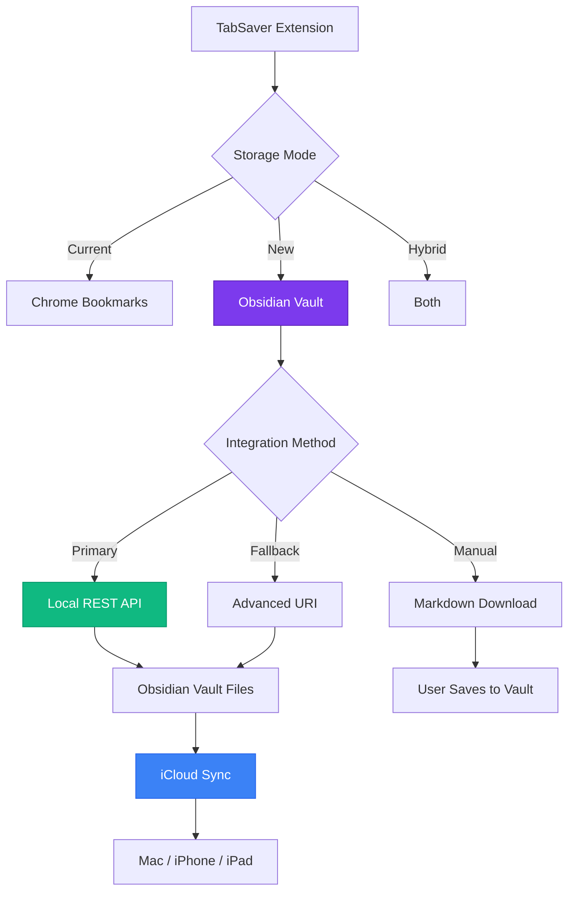

# TabSaver → Obsidian Integration Plan

**Vision**: Transform TabSaver into a powerful tab-to-knowledge bridge, seamlessly capturing browser sessions directly into your Obsidian vault while maintaining your existing iCloud sync workflow.

---

## 🎯 Executive Summary

### Current State
- **TabSaver**: Chrome extension managing tabs via native bookmarks
- **Your Setup**: Obsidian vaults synced across devices via iCloud
- **Gap**: No direct connection between browser tab management and knowledge base

### Proposed Solution
A **hybrid storage architecture** that:
1. Preserves existing Chrome bookmark functionality
2. Adds Obsidian export as a first-class storage backend
3. Enables rich metadata capture and knowledge graph integration
4. Works seamlessly with your iCloud-synced Obsidian setup

---

## 🏗️ Architecture Overview



---

## 📋 Integration Strategy: Three-Tiered Approach

### Tier 1: Local REST API (Recommended - Best UX)
**Setup**: User installs [Obsidian Local REST API](https://github.com/coddingtonbear/obsidian-local-rest-api) plugin

**Advantages**:
- ✅ Real-time bidirectional communication
- ✅ Verify note existence before writing
- ✅ Append to existing notes cleanly
- ✅ Execute Obsidian commands programmatically
- ✅ Proper error handling and feedback
- ✅ No URL length limitations
- ✅ Can read vault structure for smart suggestions

**Implementation**:
```javascript
// TabSaver → Obsidian via REST API
POST https://127.0.0.1:27124/vault/{filename}
Headers: Authorization: Bearer {api-key}
Body: { content: markdown, frontmatter: {...} }
```

**User Experience**:
1. One-time setup: Install plugin, generate API key
2. Configure in TabSaver settings (vault path, API key)
3. Click "Save to Obsidian" → instant write to vault
4. iCloud syncs to all devices automatically

---

### Tier 2: Advanced URI (Fallback - Good Compatibility)
**Setup**: User installs [Advanced URI](https://github.com/Vinzent03/obsidian-advanced-uri) plugin

**Advantages**:
- ✅ No API key required
- ✅ Simpler setup
- ✅ Works for most use cases
- ✅ Good for append operations

**Limitations**:
- ⚠️ URL length limits (~2000 chars, problematic for 20+ tabs)
- ⚠️ Fire-and-forget (no confirmation)
- ⚠️ Cannot read vault state

**Implementation**:
```javascript
// TabSaver → Obsidian via URI
obsidian://adv-uri?
  vault=MyVault&
  filepath=browser-sessions/2025-01-15&
  data={encoded_markdown}&
  mode=append
```

---

### Tier 3: Markdown Download (Universal Fallback)
**Setup**: None required

**Process**:
1. Generate markdown file in extension
2. Trigger browser download
3. User manually saves to Obsidian vault
4. iCloud picks up change

**Advantages**:
- ✅ Works without any plugins
- ✅ Zero configuration
- ✅ User has full control

**Limitations**:
- ⚠️ Manual step required
- ⚠️ No automation

---

## 🎨 Feature Design

### 1. Storage Mode Selector

**New UI Element**: Storage backend radio buttons in sidebar

```
┌─────────────────────────────────┐
│ 💾 Save Destination             │
├─────────────────────────────────┤
│ ◉ Chrome Bookmarks (current)    │
│ ○ Obsidian Vault                │
│ ○ Both (Hybrid)                 │
└─────────────────────────────────┘
```

**Smart Defaults**:
- First-time users: Chrome Bookmarks
- After Obsidian configured: Remember last choice
- "Both" mode: Write to bookmarks + Obsidian simultaneously

---

### 2. Obsidian Configuration Panel

**Settings Screen** (new tab in popup):

```
┌─────────────────────────────────────────────┐
│ ⚙️ Obsidian Integration Settings           │
├─────────────────────────────────────────────┤
│                                             │
│ Integration Method:                         │
│ ◉ Local REST API (recommended)             │
│ ○ Advanced URI                             │
│ ○ Manual Download                          │
│                                             │
│ Vault Name: [MyVault____________]          │
│                                             │
│ API Key: [••••••••••••••••••••••]          │
│ (Get from Obsidian Local REST API plugin)  │
│                                             │
│ Save Location:                              │
│ [browser-sessions/________________]         │
│                                             │
│ File Organization:                          │
│ ◉ One file per session                     │
│ ○ Append to daily note                    │
│ ○ Single file (append all sessions)       │
│                                             │
│ Template: [Edit Template]                  │
│                                             │
│ [Test Connection]  [Save Settings]         │
└─────────────────────────────────────────────┘
```

---

### 3. Markdown Template System

**Default Template**:
```markdown
---
created: {{timestamp}}
type: browser-session
source: tabsaver
window: {{window_name}}
tab_count: {{tab_count}}
tags: [tabs, browsing-session]
---

# Browser Session - {{date}}

{{#windows}}
## {{window_name}} ({{tab_count}} tabs)

{{#tabs}}
- [{{title}}]({{url}}){{#tags}} #{{tag}}{{/tags}}
{{/tabs}}

{{/windows}}

---
*Saved with TabSaver at {{time}}*
```

**Template Variables**:
- `{{timestamp}}` - ISO 8601 timestamp
- `{{date}}` - Human-readable date
- `{{time}}` - Human-readable time
- `{{window_name}}` - Browser window identifier
- `{{tab_count}}` - Number of tabs
- `{{tabs}}` - Iterable tab list
- `{{title}}` - Tab title
- `{{url}}` - Tab URL
- `{{favicon}}` - Favicon URL
- `{{tags}}` - Auto-generated tags (optional)

**Smart Tag Generation**:
```javascript
// Auto-tag based on domains
github.com → #development, #code
stackoverflow.com → #development, #reference
reddit.com → #social, #research
youtube.com → #video, #learning
docs.*.* → #documentation
```

---

### 4. Enhanced Metadata Capture

**Beyond Basic Bookmarks**:

```markdown
---
created: 2025-01-15T14:30:00Z
type: browser-session
source: tabsaver-extension
session_id: ts-20250115-143000
window_count: 2
total_tabs: 23
domains: [github.com, stackoverflow.com, obsidian.md, mdn.org]
topics: [web-development, obsidian-plugins, javascript]
tags: [tabs, research, development]
ai_summary: "Research session on Obsidian plugin development..."
---
```

**Creative Enhancement**: AI-Generated Summaries
- Use Gemini API (already familiar from nTabs)
- Analyze tab titles + URLs
- Generate 1-2 sentence session summary
- Add to frontmatter automatically
- Makes sessions searchable and memorable

---

### 5. File Organization Strategies

#### Option A: Daily Notes Integration
```
vault/
├── Daily Notes/
│   └── 2025-01-15.md ← Appends here
│       ├── Morning journaling
│       ├── Tasks for today
│       └── ## Browser Sessions
│           └── TabSaver export (14:30)
```

#### Option B: Dedicated Sessions Folder
```
vault/
├── Browser Sessions/
│   ├── 2025-01/
│   │   ├── 2025-01-15-morning-research.md
│   │   ├── 2025-01-15-evening-reading.md
│   │   └── 2025-01-16-work-project.md
```

#### Option C: Project-Based Organization
```
vault/
├── Projects/
│   ├── TabSaver Development/
│   │   ├── Research Links.md ← Appends here
│   │   └── Architecture.md
│   └── Client Project/
│       └── Reference Links.md ← Appends here
```

**User Choice**: TabSaver settings allow selecting strategy + custom path

---

### 6. Multi-Device Workflow with iCloud

**Your Current Setup**:
- Mac(s): Full Obsidian desktop app
- iPhone/iPad: Obsidian mobile app
- Sync: iCloud Drive (free, automatic)

**How TabSaver Fits**:

```
┌──────────────────────────────────────────────────┐
│ MacBook Pro (Desktop)                            │
│ ┌────────────┐      ┌────────────────┐          │
│ │  Chrome    │─────→│  TabSaver      │          │
│ │  Tabs      │      │  Extension     │          │
│ └────────────┘      └────────┬───────┘          │
│                              │                   │
│                              ↓                   │
│                     ┌────────────────┐           │
│                     │ Obsidian Vault │           │
│                     │ (iCloud Drive) │           │
│                     └────────┬───────┘           │
└──────────────────────────────┼───────────────────┘
                               │
                    iCloud Sync (automatic)
                               │
          ┌────────────────────┼────────────────────┐
          ↓                    ↓                    ↓
    ┌─────────┐          ┌─────────┐         ┌─────────┐
    │ MacBook │          │ iPhone  │         │  iPad   │
    │  Air    │          │  Pro    │         │  Air    │
    └─────────┘          └─────────┘         └─────────┘
    Full access          Read/Review         Read/Review
    (can also save)      Obsidian Mobile     Obsidian Mobile
```

**Benefits**:
1. Save tabs on any Mac with Chrome
2. Sessions instantly available on all devices
3. Review/process links on iPhone during commute
4. Reference on iPad during meetings
5. No manual export/import needed

---

## 🛠️ Technical Implementation Plan

### Phase 1: Core Integration (Week 1-2)

**1.1 Add Obsidian Detection**
```typescript
// lib/obsidian-client.ts
export class ObsidianClient {
  async detectAvailableMethods(): Promise<IntegrationMethod[]> {
    const methods = [];

    // Test REST API
    try {
      const response = await fetch('https://127.0.0.1:27124/');
      if (response.ok) methods.push('rest-api');
    } catch {}

    // Check for Advanced URI (via protocol handler)
    // Fallback always available
    methods.push('download');

    return methods;
  }
}
```

**1.2 REST API Client**
```typescript
// lib/obsidian-rest-client.ts
export class ObsidianRestClient {
  constructor(
    private baseUrl: string,
    private apiKey: string
  ) {}

  async createNote(path: string, content: string, frontmatter?: object) {
    const markdown = this.buildMarkdown(frontmatter, content);

    return fetch(`${this.baseUrl}/vault/${path}`, {
      method: 'PUT',
      headers: {
        'Authorization': `Bearer ${this.apiKey}`,
        'Content-Type': 'application/json'
      },
      body: JSON.stringify({ content: markdown })
    });
  }

  async appendToNote(path: string, content: string) {
    return fetch(`${this.baseUrl}/vault/${path}`, {
      method: 'PATCH',
      headers: {
        'Authorization': `Bearer ${this.apiKey}`,
        'Content-Type': 'application/json'
      },
      body: JSON.stringify({
        content: '\n\n' + content,
        position: 'end'
      })
    });
  }

  async noteExists(path: string): Promise<boolean> {
    const response = await fetch(`${this.baseUrl}/vault/${path}`, {
      headers: { 'Authorization': `Bearer ${this.apiKey}` }
    });
    return response.ok;
  }
}
```

**1.3 URI Client**
```typescript
// lib/obsidian-uri-client.ts
export class ObsidianUriClient {
  constructor(private vaultName: string) {}

  async saveToVault(filepath: string, content: string, mode: 'append' | 'overwrite') {
    const encodedContent = encodeURIComponent(content);
    const uri =
      `obsidian://adv-uri?` +
      `vault=${encodeURIComponent(this.vaultName)}` +
      `&filepath=${encodeURIComponent(filepath)}` +
      `&data=${encodedContent}` +
      `&mode=${mode}`;

    window.location.href = uri;
  }
}
```

**1.4 Markdown Generator**
```typescript
// lib/markdown-generator.ts
export class MarkdownGenerator {
  constructor(private template: string) {}

  generate(tabs: Tab[], metadata: SessionMetadata): string {
    // Parse template with Mustache-like syntax
    // Support loops, conditionals, filters

    const data = {
      timestamp: new Date().toISOString(),
      date: formatDate(new Date()),
      time: formatTime(new Date()),
      tab_count: tabs.length,
      tabs: tabs.map(t => ({
        title: t.title,
        url: t.url,
        domain: new URL(t.url).hostname,
        tags: this.generateTags(t.url)
      })),
      ...metadata
    };

    return this.renderTemplate(this.template, data);
  }

  private generateTags(url: string): string[] {
    const hostname = new URL(url).hostname;
    const tagMap = {
      'github.com': ['development', 'code'],
      'stackoverflow.com': ['development', 'reference'],
      'reddit.com': ['social', 'research'],
      'youtube.com': ['video', 'learning'],
      // ... extensible
    };

    return tagMap[hostname] || [];
  }
}
```

---

### Phase 2: UI Enhancement (Week 2-3)

**2.1 Settings Panel**
```svelte
<!-- entrypoints/popup/Settings.svelte -->
<script lang="ts">
  import { obsidianConfig } from '$lib/stores';
  import { ObsidianClient } from '$lib/obsidian-client';

  let client = new ObsidianClient();
  let availableMethods = [];
  let testStatus = '';

  async function detectMethods() {
    availableMethods = await client.detectAvailableMethods();
  }

  async function testConnection() {
    if ($obsidianConfig.method === 'rest-api') {
      const restClient = new ObsidianRestClient(
        'https://127.0.0.1:27124',
        $obsidianConfig.apiKey
      );

      try {
        const exists = await restClient.noteExists('test.md');
        testStatus = 'success';
      } catch (error) {
        testStatus = 'error: ' + error.message;
      }
    }
  }
</script>

<div class="settings-panel glass-panel">
  <h2>Obsidian Integration</h2>

  <div class="method-selector">
    <label>
      <input type="radio" bind:group={$obsidianConfig.method} value="rest-api">
      Local REST API (recommended)
    </label>
    <label>
      <input type="radio" bind:group={$obsidianConfig.method} value="uri">
      Advanced URI
    </label>
    <label>
      <input type="radio" bind:group={$obsidianConfig.method} value="download">
      Manual Download
    </label>
  </div>

  {#if $obsidianConfig.method === 'rest-api'}
    <div class="api-config">
      <input
        type="text"
        placeholder="Vault Name"
        bind:value={$obsidianConfig.vaultName}
      />
      <input
        type="password"
        placeholder="API Key"
        bind:value={$obsidianConfig.apiKey}
      />
      <button on:click={testConnection}>Test Connection</button>
      {#if testStatus}
        <p class="status {testStatus.startsWith('success') ? 'success' : 'error'}">
          {testStatus}
        </p>
      {/if}
    </div>
  {/if}

  <div class="file-config">
    <label>
      Save Location:
      <input
        type="text"
        placeholder="browser-sessions/"
        bind:value={$obsidianConfig.savePath}
      />
    </label>

    <label>
      File Organization:
      <select bind:value={$obsidianConfig.organization}>
        <option value="session">One file per session</option>
        <option value="daily">Append to daily note</option>
        <option value="single">Single file (all sessions)</option>
      </select>
    </label>
  </div>
</div>
```

**2.2 Storage Mode Toggle**
```svelte
<!-- In main App.svelte -->
<div class="storage-selector">
  <label>
    <input type="radio" bind:group={$storageMode} value="bookmarks">
    🔖 Chrome Bookmarks
  </label>
  <label>
    <input type="radio" bind:group={$storageMode} value="obsidian">
    📝 Obsidian Vault
  </label>
  <label>
    <input type="radio" bind:group={$storageMode} value="both">
    💾 Both
  </label>
</div>
```

---

### Phase 3: Smart Features (Week 3-4)

**3.1 AI Summary Generation** (Optional but Cool)
```typescript
// lib/ai-summarizer.ts
export class SessionSummarizer {
  constructor(private geminiApiKey: string) {}

  async generateSummary(tabs: Tab[]): Promise<string> {
    const tabDescriptions = tabs
      .map(t => `- ${t.title} (${new URL(t.url).hostname})`)
      .join('\n');

    const prompt = `
      Analyze this browser session and provide a 1-2 sentence summary
      describing what the user was researching or working on:

      ${tabDescriptions}

      Summary:
    `;

    const response = await fetch(
      'https://generativelanguage.googleapis.com/v1beta/models/gemini-pro:generateContent',
      {
        method: 'POST',
        headers: {
          'Content-Type': 'application/json',
          'x-goog-api-key': this.geminiApiKey
        },
        body: JSON.stringify({
          contents: [{ parts: [{ text: prompt }] }]
        })
      }
    );

    const data = await response.json();
    return data.candidates[0].content.parts[0].text;
  }
}
```

**3.2 Smart File Naming**
```typescript
// lib/file-namer.ts
export class SmartFileNamer {
  generateSessionName(tabs: Tab[]): string {
    // Extract dominant domain
    const domains = tabs.map(t => new URL(t.url).hostname);
    const domainCounts = this.countOccurrences(domains);
    const topDomain = domainCounts[0]?.domain;

    // Generate contextual name
    if (topDomain?.includes('github')) {
      return 'dev-research-' + this.dateStamp();
    } else if (topDomain?.includes('youtube')) {
      return 'video-learning-' + this.dateStamp();
    } else if (tabs.length > 15) {
      return 'deep-dive-' + this.dateStamp();
    } else {
      return 'browsing-session-' + this.dateStamp();
    }
  }

  private dateStamp(): string {
    const now = new Date();
    return now.toISOString().split('T')[0];
  }
}
```

**3.3 Duplicate Detection**
```typescript
// lib/duplicate-detector.ts
export class DuplicateDetector {
  constructor(private restClient: ObsidianRestClient) {}

  async findExistingLinks(tabs: Tab[]): Promise<Map<string, string>> {
    // Search vault for existing URLs
    const urls = tabs.map(t => t.url);
    const duplicates = new Map<string, string>();

    // Use REST API to search
    const searchResults = await this.restClient.search(
      urls.map(url => `"${url}"`).join(' OR ')
    );

    // Map URL → note path
    searchResults.forEach(result => {
      urls.forEach(url => {
        if (result.content.includes(url)) {
          duplicates.set(url, result.path);
        }
      });
    });

    return duplicates;
  }
}
```

---

### Phase 4: Polish & Testing (Week 4)

**4.1 Setup Wizard**
- First-time Obsidian user flow
- Plugin installation guidance
- API key generation walkthrough
- Vault selection

**4.2 Error Handling**
- Connection failures → fallback to download
- Invalid API key → clear error message
- Vault not found → suggest vault list
- Large session → warn about URI length

**4.3 User Documentation**
- Add `docs/OBSIDIAN_SETUP.md`
- Screenshot walkthrough
- Video tutorial (optional)
- Troubleshooting guide

---

## 📊 Data Structure Examples

### Example 1: Development Research Session
```markdown
---
created: 2025-01-15T10:30:00Z
type: browser-session
source: tabsaver
session_id: ts-20250115-103000
tab_count: 12
domains: [github.com, stackoverflow.com, mdn.org, docs.obsidian.md]
topics: [obsidian-plugins, typescript, chrome-extensions]
tags: [development, research, obsidian, tabsaver]
ai_summary: "Research session focused on Obsidian plugin development, including API documentation, TypeScript patterns, and Chrome extension integration strategies."
---

# Development Research - January 15, 2025

## Session Overview
12 tabs saved at 10:30 AM while researching Obsidian plugin integration.

## Tabs

- [Obsidian Plugin API Documentation](https://docs.obsidian.md/Plugins/Getting+started/Build+a+plugin) #documentation #obsidian
- [Local REST API for Obsidian](https://github.com/coddingtonbear/obsidian-local-rest-api) #tools #api
- [Advanced URI Plugin](https://vinzent03.github.io/obsidian-advanced-uri/) #tools #plugins
- [Chrome Extension Manifest V3](https://developer.chrome.com/docs/extensions/mv3/) #chrome #reference
- [TypeScript Handbook](https://www.typescriptlang.org/docs/handbook/intro.html) #typescript #documentation
- [Obsidian Sample Plugin](https://github.com/obsidianmd/obsidian-sample-plugin) #code #examples
- [Svelte Documentation](https://svelte.dev/docs) #svelte #frontend
- [WXT Framework Docs](https://wxt.dev/) #wxt #chrome-extensions
- [MDN Web APIs](https://developer.mozilla.org/en-US/docs/Web/API) #reference #web-dev
- [Stack Overflow: Obsidian Plugin Questions](https://stackoverflow.com/questions/tagged/obsidian) #community #help
- [GitHub: obsidian-api Repository](https://github.com/obsidianmd/obsidian-api) #code #api
- [Obsidian Forum: Plugin Development](https://forum.obsidian.md/c/plugin-development/8) #community #forum

---
*Saved with TabSaver v2.0 • [Reopen Session](obsidian://adv-uri?commandid=tabsaver-reopen-ts-20250115-103000)*
```

### Example 2: Evening Reading (appended to daily note)
```markdown
## 🌐 Browser Sessions

### Evening Reading - 21:30
*5 tabs saved with TabSaver*

- [The Psychology of Color](https://example.com/color-psychology) #psychology #design
- [Understanding CSS Grid](https://css-tricks.com/snippets/css/complete-guide-grid/) #css #tutorial
- [Best Sci-Fi Books 2025](https://goodreads.com/list/sci-fi-2025) #books #reading-list
- [Minimalist Home Design Ideas](https://pinterest.com/minimalist-home) #design #inspiration
- [Meditation Techniques for Beginners](https://headspace.com/meditation-101) #mindfulness #health
```

---

## 🎯 User Experience Flows

### Flow 1: First-Time Setup
```
1. User installs TabSaver
2. Clicks "Settings" → "Obsidian Integration"
3. Sees setup wizard:
   ┌─────────────────────────────────────────┐
   │ Welcome to Obsidian Integration!        │
   │                                         │
   │ Choose your integration method:        │
   │                                         │
   │ ┌───────────────────────────────────┐  │
   │ │ 🔌 Local REST API (Recommended)  │  │
   │ │ • Most reliable                  │  │
   │ │ • Rich features                  │  │
   │ │ • Requires plugin install        │  │
   │ │ [Select & Install Plugin]        │  │
   │ └───────────────────────────────────┘  │
   │                                         │
   │ ┌───────────────────────────────────┐  │
   │ │ 🔗 Advanced URI                  │  │
   │ │ • Simple setup                   │  │
   │ │ • Good for small sessions        │  │
   │ │ [Select & Install Plugin]        │  │
   │ └───────────────────────────────────┘  │
   │                                         │
   │ ┌───────────────────────────────────┐  │
   │ │ 📥 Manual Download               │  │
   │ │ • No plugins needed              │  │
   │ │ • Works immediately              │  │
   │ │ [Select]                         │  │
   │ └───────────────────────────────────┘  │
   └─────────────────────────────────────────┘

4. If REST API selected:
   • Opens plugin installation link in Obsidian
   • Shows API key input field
   • User copies key from Obsidian, pastes
   • TabSaver tests connection
   • Success! Ready to save

5. Configure preferences:
   • Vault name (auto-detected if possible)
   • Save location path
   • File organization strategy
   • Template customization (optional)

6. Save first session → seamless!
```

### Flow 2: Daily Usage (Power User)
```
Morning: Research Session
1. Open 15 tabs researching Obsidian plugins
2. Click TabSaver icon
3. Storage mode: "Obsidian" (remembered)
4. Select all tabs
5. Edit session name: "Obsidian Plugin Research"
6. Click "Save to Obsidian"
7. ✓ Saved to: browser-sessions/2025-01-15-obsidian-plugin-research.md
8. iCloud syncs in background
9. Open Obsidian → see new note with all links
10. Add notes/annotations in Obsidian
11. Available on iPhone during lunch

Afternoon: Quick Save
1. 3 interesting articles found
2. Click TabSaver → "Save to Obsidian"
3. Auto-appends to today's daily note
4. Done in 2 clicks

Evening: Review on iPad
1. Open Obsidian on iPad
2. Navigate to today's sessions
3. Open interesting links for reading
4. Add to reading list or reference notes
```

### Flow 3: Hybrid Mode (Best of Both Worlds)
```
1. Configure TabSaver: Storage Mode = "Both"
2. Save session with 10 tabs
3. TabSaver simultaneously:
   • Creates Chrome bookmark folder "Tabs - Jan 15, 2025"
   • Writes markdown to Obsidian "browser-sessions/2025-01-15.md"
4. Benefits:
   • Chrome bookmarks: Quick browser access, works offline
   • Obsidian: Rich notes, knowledge graph, search, tagging
   • iCloud: Available on mobile devices
```

---

## 🚀 Creative Enhancements (Future Ideas)

### 1. **Knowledge Graph Integration**
```markdown
---
links_to: [[Previous Research Session]], [[Project Notes]]
inspired_by: [[Web Development Resources]]
related_topics: [[Chrome Extensions]], [[Obsidian Workflows]]
---
```
Auto-suggest related notes based on content similarity.

### 2. **Tab Group Preservation**
```markdown
## Tab Groups

### 📊 Data Analysis (5 tabs)
- Google Sheets template
- Chart.js documentation
- Data visualization examples
- D3.js tutorial
- Analytics dashboard

### 🎨 Design Inspiration (4 tabs)
- Dribbble UI examples
- Color palette generator
- Icon library
- Typography guide
```

### 3. **Reading Time Estimates**
```markdown
- [Long Article Title](https://example.com) • ~12 min read
- [Technical Documentation](https://docs.example.com) • ~8 min read
- [Quick Tutorial](https://tutorial.example.com) • ~3 min read

**Total reading time**: ~23 minutes
```

### 4. **Smart Session Recommendations**
```markdown
---
suggestions:
  - "Consider creating a MOC (Map of Content) for this research"
  - "Related: [[Previous Session on Same Topic]]"
  - "Tag for later review: #to-process"
---
```

### 5. **Export Statistics Dashboard**
```markdown
# TabSaver Statistics

## This Month
- Sessions saved: 47
- Total tabs: 312
- Top domains: github.com (89), mdn.org (45), stackoverflow.com (32)
- Most productive day: Tuesday (avg 12 tabs/session)
- Knowledge nodes created: 47 (one per session)

## Integration Health
- Obsidian sync: ✓ Active
- iCloud status: ✓ Synced
- Last successful save: 2 minutes ago
```

### 6. **Mobile Companion Features**
```markdown
# TabSaver Mobile Workflow

## On Mac:
1. Save tabs from Chrome → Obsidian
2. iCloud syncs automatically

## On iPhone:
1. Open Obsidian app
2. View saved sessions
3. Tap link → opens in Safari
4. Long-press → "Open in Background Tab"
5. Build reading queue for offline

## On iPad:
1. Split screen: Obsidian + Safari
2. Reference links while working
3. Annotate in Obsidian
4. Syncs back to Mac
```

---

## 🔒 Privacy & Security Considerations

### Data Flow
```
TabSaver Extension (Local)
        ↓
Obsidian Vault (Local Files)
        ↓
iCloud (Encrypted in Transit)
        ↓
Your Other Devices (Local Files)
```

**Privacy Wins**:
- ✅ No third-party servers (unlike old nTabs → Notion)
- ✅ All data stays in your control
- ✅ iCloud encryption in transit
- ✅ Local file storage on all devices
- ✅ No external API dependencies
- ✅ Open markdown format (future-proof)

**Security Notes**:
- Local REST API uses HTTPS (self-signed cert)
- API key stored in Chrome extension storage (encrypted)
- Vault files readable only by you
- iCloud uses end-to-end encryption (if enabled)

---

## 📈 Success Metrics

### User Adoption
- % of users who enable Obsidian integration
- Active users saving to Obsidian weekly
- Average sessions saved per user

### Technical Performance
- API response time (< 100ms target)
- Save success rate (> 99% target)
- Sync time to iCloud (measured)

### User Satisfaction
- Setup completion rate
- Feature usage (which integration method preferred)
- User feedback/ratings

---

## 🛣️ Implementation Roadmap

### Week 1: Foundation
- [ ] Research & planning (✓ Complete)
- [ ] Set up Obsidian test vault
- [ ] Install Local REST API plugin
- [ ] Test API endpoints manually
- [ ] Design data structures

### Week 2: Core Development
- [ ] Build ObsidianClient abstraction layer
- [ ] Implement REST API client
- [ ] Implement URI client
- [ ] Build markdown generator with templates
- [ ] Create Obsidian settings UI

### Week 3: Integration & UI
- [ ] Add storage mode selector to main UI
- [ ] Implement "Both" hybrid mode
- [ ] Build setup wizard flow
- [ ] Add connection testing
- [ ] Smart file naming logic

### Week 4: Enhancement & Testing
- [ ] AI summary generation (optional)
- [ ] Duplicate detection
- [ ] Smart tag generation
- [ ] Error handling & fallbacks
- [ ] User documentation

### Week 5: Polish & Launch
- [ ] Beta testing with real vault
- [ ] Test iCloud sync workflow
- [ ] Multi-device testing (Mac/iPhone/iPad)
- [ ] Performance optimization
- [ ] Public documentation
- [ ] Launch! 🚀

---

## 📚 Resources & References

### Obsidian Plugins to Install
1. **Local REST API** (Primary Method)
   - GitHub: https://github.com/coddingtonbear/obsidian-local-rest-api
   - Install: Obsidian → Settings → Community Plugins → Browse → "Local REST API"

2. **Advanced URI** (Fallback Method)
   - GitHub: https://github.com/Vinzent03/obsidian-advanced-uri
   - Install: Same process as above

### Documentation
- Obsidian Developer Docs: https://docs.obsidian.md/
- Obsidian API Reference: https://github.com/obsidianmd/obsidian-api
- Local REST API Docs: https://coddingtonbear.github.io/obsidian-local-rest-api/
- Advanced URI Docs: https://vinzent03.github.io/obsidian-advanced-uri/

### Inspiration (Existing Tools)
- tabSidian: https://github.com/cgranier/tabSidian
- Obsidian Bookmarker: https://github.com/sbtourist/obsidian-bookmarker
- Firefox Obsidian Bookmark: https://github.com/patrikzudel/firefox-obsidian-bookmark

### Your Current Tech Stack
- TabSaver: WXT + Svelte + TypeScript
- Obsidian: Electron app with plugin ecosystem
- Sync: iCloud Drive (cross-device)

---

## 🎬 Conclusion

This integration transforms TabSaver from a browser extension into a **knowledge capture tool** that bridges your browsing and note-taking workflows. By leveraging Obsidian's local-first, markdown-based architecture and your existing iCloud sync setup, you get:

1. **Seamless Capture**: Save tabs → Obsidian in one click
2. **Rich Context**: Metadata, tags, summaries beyond basic bookmarks
3. **Cross-Device Access**: iCloud syncs to all your devices automatically
4. **Future-Proof**: Open markdown format, no vendor lock-in
5. **Privacy-First**: All data stays in your control
6. **Flexible Organization**: Daily notes, sessions, projects - your choice
7. **Knowledge Graph**: Links become nodes in your knowledge network

**Next Step**: Review this plan, decide on priority features, and let's start building! 🚀

---

*Created: January 15, 2025*
*Status: Ready for Implementation*
*Estimated Time: 4-5 weeks for full feature set*