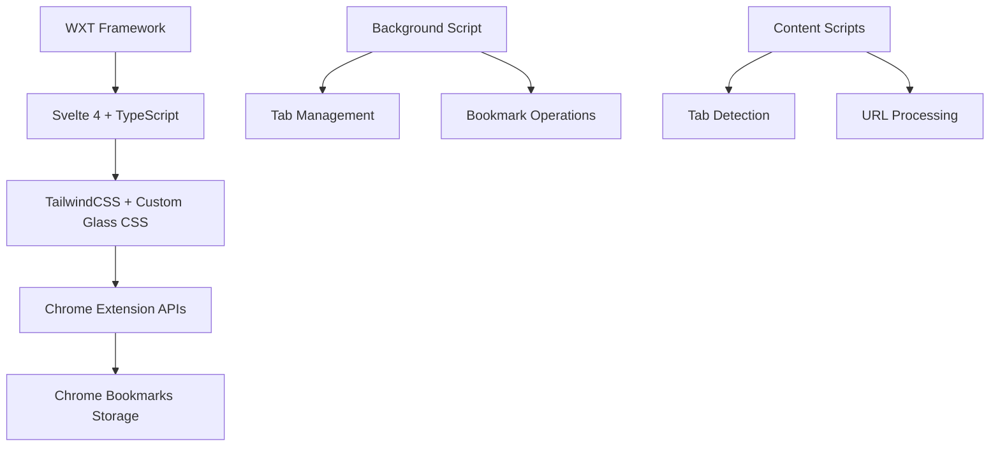
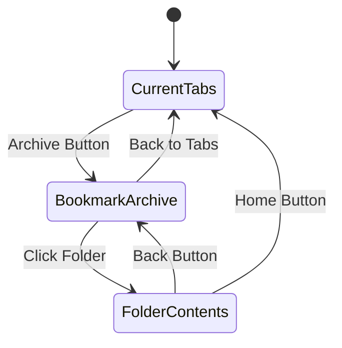

<div align="center">

# 📑 TabSaver

### *Modern Chrome Tab Management with Liquid Glass Design*

[](https://chrome.google.com/webstore/)
[](https://svelte.dev/)
[](https://www.typescriptlang.org/)
[](https://opensource.org/licenses/MIT)

*Evolved from the popular nTabs extension, now with native Chrome bookmarks and stunning glass morphism UI*

</div>

---

## ✨ **Features**

<table>
<tr>
<td width="50%">

### 🎯 **Core Functionality**
- 📊 **Tab Management** - View all open tabs in a clean table
- ✅ **Multi-Select** - Select multiple tabs with checkboxes
- 🔖 **Bookmark Integration** - Save directly to Chrome bookmarks
- 📁 **Smart Organization** - Auto-organized bookmark folders
- 🚀 **Bulk Operations** - Close, save, or open multiple tabs

</td>
<td width="50%">

### 🎨 **Modern Design**
- 🌟 **Liquid Glass UI** - Beautiful dark glass morphism
- 📱 **Sidebar Layout** - Optimized space utilization
- 🎭 **High Contrast** - Excellent readability
- ⚡ **Smooth Animations** - Fluid hover and click effects
- 📐 **Responsive Design** - Perfect 800x650px window

</td>
</tr>
</table>

---

## 🏗️ **Architecture**

> **Built with Modern Web Technologies**



<div align="center">

| Technology | Purpose | Version |
|------------|---------|---------|
|  | Chrome Extension Framework | 0.19.x |
|  | Reactive UI Components | 4.x |
|  | Type Safety | Latest |
|  | Utility-First CSS | 3.x |

</div>

---

## 🎨 **Design Philosophy**

### **From nTabs to TabSaver**

TabSaver is the spiritual successor to **nTabs**, completely reimagined for 2024:

<table>
<tr>
<th>🔄 Migration from nTabs</th>
<th>✨ TabSaver Innovation</th>
</tr>
<tr>
<td>

- ❌ Notion dependency removed
- ❌ External API requirements eliminated
- ❌ Light theme with poor contrast
- ❌ Cramped vertical layout

</td>
<td>

- ✅ Native Chrome bookmarks integration
- ✅ Zero external dependencies
- ✅ Dark liquid glass theme
- ✅ Optimized sidebar layout

</td>
</tr>
</table>

### **Liquid Glass Design System**

<div align="center">

```css
/* Core Glass Morphism */
backdrop-filter: blur(20px);
background: linear-gradient(135deg,
  rgba(15, 23, 42, 0.95),
  rgba(51, 65, 85, 0.85)
);
border: 1px solid rgba(6, 182, 212, 0.3);
box-shadow: 0 20px 40px rgba(0, 0, 0, 0.4);
```

</div>

---

## 🚀 **Installation**

### **Method 1: Development Installation**

```bash
# Clone the repository
git clone https://github.com/dbbaskette/TabSaver.git
cd TabSaver

# Install dependencies
npm install

# Build the extension
npm run build

# Output will be in .output/chrome-mv3/
```

### **Method 2: Load Unpacked**

1. 🌐 Open Chrome → `chrome://extensions/`
2. 🔧 Enable **Developer mode** (top-right toggle)
3. 📁 Click **Load unpacked** → Select `.output/chrome-mv3/` folder
4. 🎉 TabSaver icon appears in toolbar!

### **Method 3: Chrome Web Store** *(Coming Soon)*

<div align="center">

[](https://chrome.google.com/webstore/)

</div>

---

## 💡 **Usage Guide**

### **🎯 Quick Start**

<table>
<tr>
<td width="60%">

### **Main Interface**

1. **📊 View Tabs** - All current window tabs displayed
2. **☑️ Select Tabs** - Use header checkbox or individual selections
3. **📁 Set Folder** - Enter custom bookmark folder name
4. **💾 Save/Close** - Use sidebar buttons for actions
5. **📂 Browse Archive** - Access saved bookmark folders

</td>
<td width="40%">

### **Sidebar Actions**

- 🔖 **Save** - Bookmark selected tabs
- ❌ **Close** - Close selected tabs
- 💾 **Save & Close** - Bookmark then close
- 📂 **Archive** - Browse saved folders
- 🔄 **Refresh** - Reload tab list

</td>
</tr>
</table>

### **🎨 Three-View Navigation**

<div align="center">



</div>

| View | Purpose | Actions Available |
|------|---------|-------------------|
| **📊 Current Tabs** | Manage open browser tabs | Select, Save, Close, Archive |
| **📂 Bookmark Archive** | Browse saved folders | Open folder, Open all tabs |
| **📑 Folder Contents** | View bookmarks in folder | Select, Open bookmarks |

---

## 🎨 **Screenshots**

<div align="center">

### **Dark Liquid Glass Interface**

<table>
<tr>
<td align="center"><strong>📊 Current Tabs View</strong></td>
<td align="center"><strong>📂 Bookmark Archive</strong></td>
</tr>
<tr>
<td></td>
<td></td>
</tr>
</table>

### **Key UI Elements**

<table>
<tr>
<td align="center"><strong>🎛️ Sidebar Controls</strong></td>
<td align="center"><strong>📑 Folder Contents</strong></td>
</tr>
<tr>
<td></td>
<td></td>
</tr>
</table>

</div>

---

## 🛠️ **Development**

### **🏗️ Tech Stack**

<div align="center">

| Layer | Technology | Purpose |
|-------|------------|---------|
| **🏗️ Framework** | WXT | Chrome extension development |
| **⚛️ Frontend** | Svelte 4 + TypeScript | Reactive UI components |
| **🎨 Styling** | TailwindCSS + Custom CSS | Liquid glass morphism |
| **🔧 Build** | Vite | Fast development and building |
| **📦 Package** | NPM | Dependency management |

</div>

### **📁 Project Structure**

```
TabSaver/
├── 📁 entrypoints/           # Extension entry points
│   ├── 🎨 popup/            # Main popup interface
│   │   ├── App.svelte       # Main UI component
│   │   ├── main.ts          # Entry point
│   │   └── index.html       # HTML template
│   └── ⚙️ background.ts     # Background script
├── 📚 lib/                  # Shared utilities
│   ├── stores.ts           # Svelte stores
│   ├── types.ts            # TypeScript types
│   └── bookmark-utils.ts   # Bookmark operations
├── 🎨 assets/              # Static assets
│   └── css/main.css        # Global styles
├── ⚙️ wxt.config.ts        # WXT configuration
└── 📝 package.json         # Dependencies
```

### **🚀 Development Commands**

```bash
# 🔧 Development server with hot reload
npm run dev

# 🏗️ Production build
npm run build

# 📦 Create distribution zip
npm run zip

# 🧹 Clean build artifacts
npm run clean

# 🔍 Type checking
npm run typecheck
```

### **🎨 Customizing the Glass Theme**

```css
/* Custom glass panel colors */
.glass-panel {
  background: linear-gradient(135deg,
    rgba(YOUR_COLOR, 0.8),
    rgba(YOUR_COLOR, 0.6)
  );
  border: 1px solid rgba(YOUR_ACCENT, 0.3);
}

/* Sidebar button hover colors */
.sidebar-btn:hover {
  background: linear-gradient(135deg,
    rgba(YOUR_ACCENT, 0.2),
    rgba(YOUR_ACCENT, 0.1)
  );
  color: YOUR_ACCENT_COLOR;
}
```

---

## 🤝 **Contributing**

<div align="center">

### **🎯 We Welcome Contributions!**

[](https://github.com/dbbaskette/TabSaver/graphs/contributors)
[](https://github.com/dbbaskette/TabSaver/issues)
[](https://github.com/dbbaskette/TabSaver/pulls)

</div>

### **📋 Contribution Guidelines**

1. **🍴 Fork** the repository
2. **🌿 Create** a feature branch (`git checkout -b feature/amazing-feature`)
3. **✅ Commit** your changes (`git commit -m 'Add amazing feature'`)
4. **📤 Push** to the branch (`git push origin feature/amazing-feature`)
5. **🔀 Open** a Pull Request

### **🎯 Areas for Contribution**

- 🎨 **UI/UX Improvements** - Enhance the glass morphism design
- ⚡ **Performance** - Optimize rendering and memory usage
- 🌐 **Internationalization** - Add multi-language support
- 🧪 **Testing** - Add comprehensive test coverage
- 📚 **Documentation** - Improve guides and API docs

---

## 📜 **License**

<div align="center">

### **MIT License**

```
Copyright (c) 2024 TabSaver Contributors

Permission is hereby granted, free of charge, to any person obtaining a copy
of this software and associated documentation files (the "Software"), to deal
in the Software without restriction, including without limitation the rights
to use, copy, modify, merge, publish, distribute, sublicense, and/or sell
copies of the Software, and to permit persons to whom the Software is
furnished to do so, subject to the following conditions:

The above copyright notice and this permission notice shall be included in all
copies or substantial portions of the Software.
```

[📖 **Full License Text**](LICENSE)

</div>

---

## 🙏 **Acknowledgments**

<div align="center">

### **🎯 Special Thanks**

| Project | Contribution |
|---------|-------------|
| **🔗 [nTabs](https://github.com/dbbaskette/nTabs)** | Original inspiration and concept |
| **⚛️ [Svelte](https://svelte.dev/)** | Reactive UI framework |
| **🏗️ [WXT](https://wxt.dev/)** | Modern extension development |
| **🎨 [TailwindCSS](https://tailwindcss.com/)** | Utility-first CSS framework |

### **🌟 Contributors**

Thanks to all the amazing people who have contributed to TabSaver!

[](https://github.com/dbbaskette/TabSaver/graphs/contributors)

</div>

---

<div align="center">

### **💫 Made with ❤️ for Tab Management**

[](https://github.com/dbbaskette/TabSaver)
[](https://github.com/dbbaskette)

*If TabSaver helps you stay organized, please consider giving it a ⭐!*

</div>